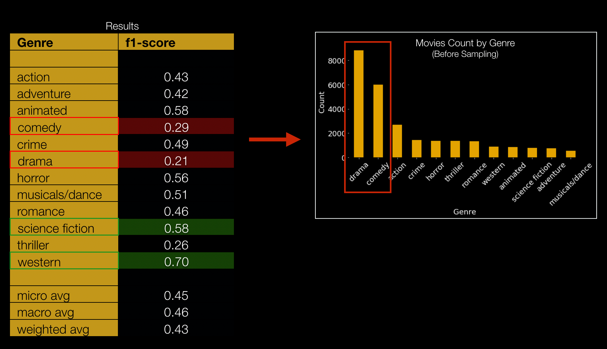

# What genre is this movie? (An NLP Project)

## Overview
We all love watching movies. It's helpful to use genre as a way to decide what movie to watch, without reading full movie descriptions. But it's not always easy to identify genre of a movie, without people watching or at least reading the description of a movie. What if there's a way to identify genre using natural language processing, based on movie plot? Possible applications could be to predict genre when there is none available. Perhaps more common though, is to help identify alternative applicable genres even when there is one identified.

## Data Source
[Wikipedia movie plots data from Kaggle](https://www.kaggle.com/jrobischon/wikipedia-movie-plots)

 (34886 movies)

## Code at Github
Here is the github repo for this project: [link](https://github.com/pytgit/movies_genre_nlp)

## Tools Used
Python is used for data acquisition, cleaning and modeling. Specific python libraries used include:
* Modeling: scikit-learn, imbalanced-learn
* Natural language processing:
  * NTLK: for sentiment analysis
  * Spacy: for text preprocessing and cleaning

## Methodology Used
1. Genre clean-up:
   * Data initially had as many as 2264 genres. Many were either too granular or mis-spellings, so some clean-up is needed. For example, the following were re-mapped as "comedy" genre:
   > ‘comedey', 'spoof', 'standup', 'slapstick', 'parody'
   * Low-count genre entries were removed (kept top 95%)
   * This clean-up process resulted in 12 genres

2. Data is randomly sampled from ~30,000 to 10,000 with weights biased towards lower count genres for NLP processing and training speed.

3. Each sentence in a movie plot text is then evaluated for sentiment using NTLK's vader analyzer. The results are then averaged to be treated as a sentiment feature for that movie entry.

(See Jupyter notebook for steps 1-3: [(code here)](https://github.com/pytgit/movies_genre_nlp/blob/master/Movies%20-%20clean%20and%20feature%20extraction.ipynb) )

5. Topic modeling is used to reduce the dimensionality of the bag of words to be used as classification features. Before topic modeling can be done, stopwords, punctuations, and entities were removed from the movie plot text. The text is also tokenized and lemmatized.

6. Both Non-negative Matrix Factorization (NMF) and Latent Semantic Analysis (LSA) topic modeling were tried. They gave similar results when used in supervised classification modeling later, but I decided to use NMF in the final model because the topics were more interpretable than the LSA ones. THE NMF yielded 25 topics were seemed to be representative of certain genres. For example:
   * Topic 1	(Romance): love, fall love, fall, marry, marriage, girl, meet, friend, wedding, story
   * Topic 2	 (Sci-Fi): alien, planet, spaceship, human, saucer, destroy, space, base, ship, scientist

(See Jupyter notebook for steps 5,6: [(code here)](https://github.com/pytgit/movies_genre_nlp/blob/master/Movies-%20topic%20modeling.ipynb) )

7. For final genre prediction, Random Forest, KNN and Gradient Boost. Random Forest gave slighly better results than GradientBoost so that was chosen as final model. See Jupyter notebook for steps [(code here)](https://github.com/pytgit/movies_genre_nlp/blob/master/Supervised%20Model%20Training.ipynb)

## Results
* Random Forest yielded the best F1 weighted score of 0.43 on test data set

  

* As seen from the results, "Sci-Fi" and "Western" got best prediction results, but "Drama", "Comedy" were among the worst.

## Conclusions
* Genre categorization impacts the prediction results so more analysis on optimal categorization would be µMhelpful
* Multi-label classification instead of multi-class classification is also a great next step to provide better insights for potential applications as movies often can belong to multiple genres
